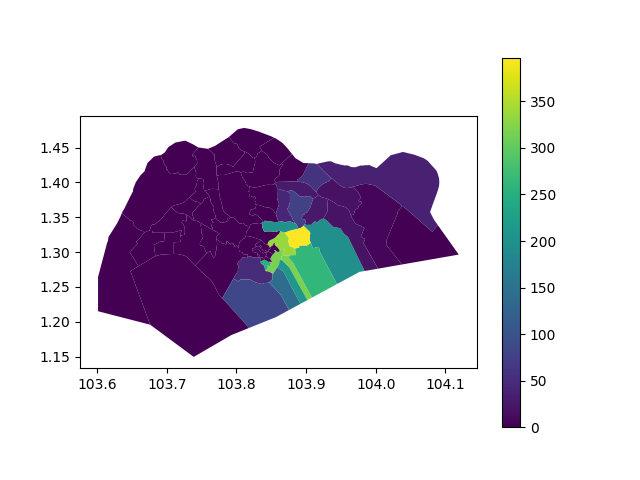

# Intro

Code to show case python's GIS ability using geopandas

In [main.py](main.py):
* Load PlanningBoundaryArea obtained from https://beta.data.gov.sg/datasets/d_cc2f9c99c2a7cb55a54ad0f522016011/view
* Load car park locations [Car_Park_Details.json](Car_Park_Details.json) obtained from https://www.ura.gov.sg/maps/api/#car-park-list-and-rates
* Convert geometries from SVY21 to WGS84
* Count car parks in each boundary
* Plot to [carparks.png](carparks.png)

Jupyter Notebook is also available: [test.ipynb](test.ipynb).
